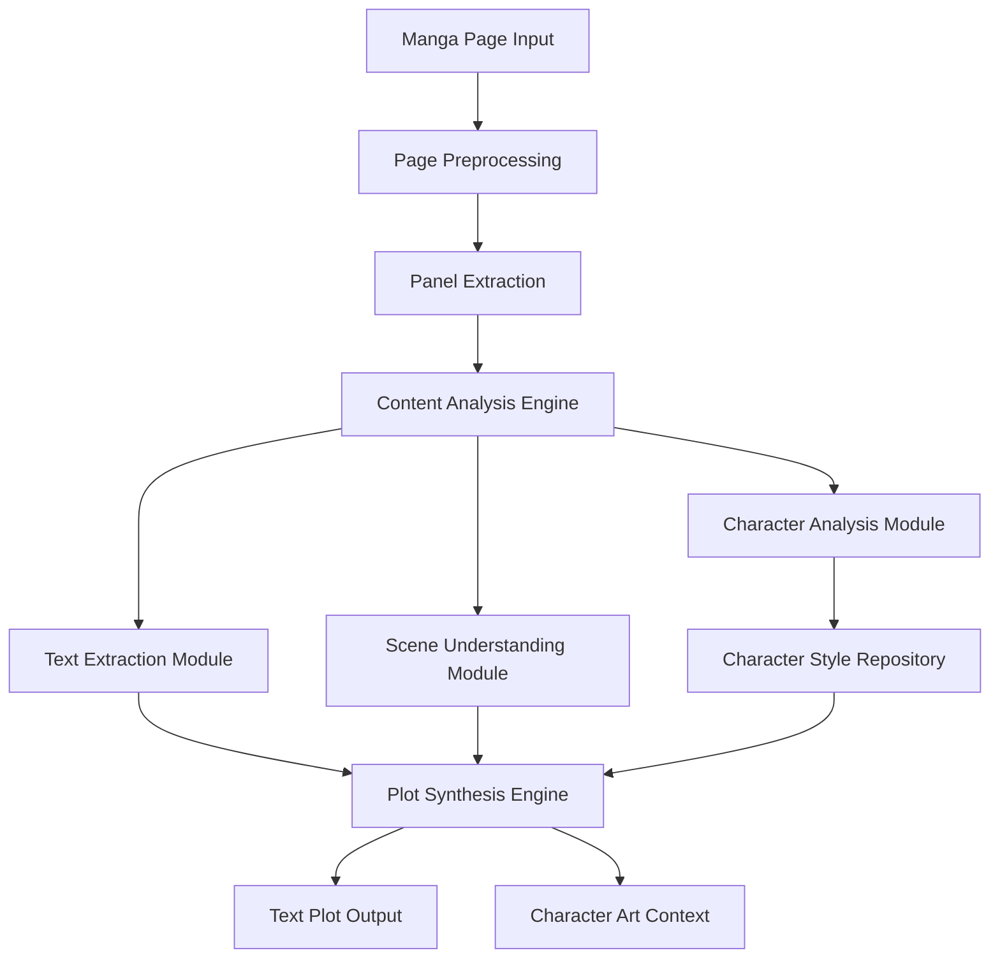
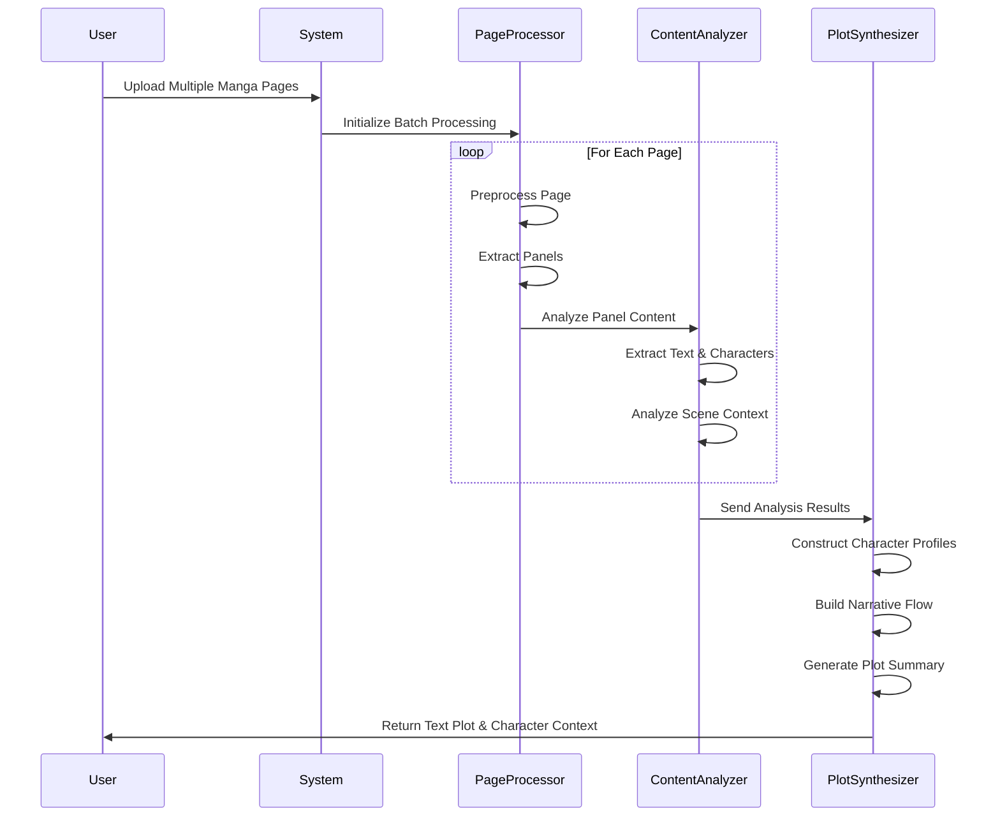
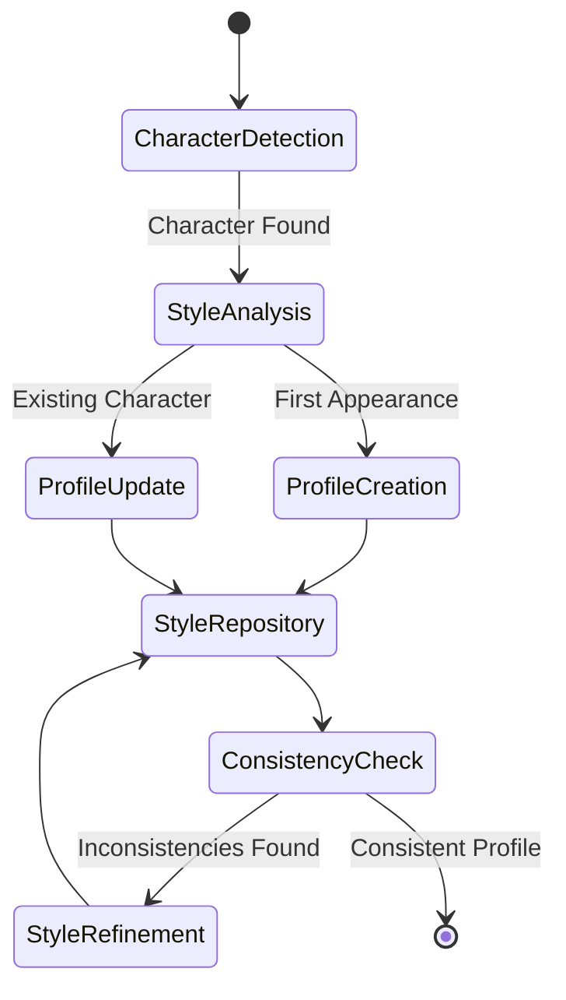

# Manga-to-Text Plot Extraction System Design

## Overview

The Manga-to-Text Plot Extraction System transforms static manga pages into structured text-based narratives while preserving essential character art style context. The system analyzes multiple manga pages to extract dialogue, narrative elements, character descriptions, and visual storytelling components, then synthesizes them into coherent plot summaries with character art style references.

### Core Value Proposition

- Extract coherent storylines from sequential manga pages
- Preserve character visual identity and art style context
- Generate structured plot summaries suitable for further processing
- Maintain narrative flow and character relationships across pages

### Key Capabilities

- Multi-page manga analysis and content extraction
- Character identification and art style documentation
- Dialogue extraction and speaker attribution
- Scene context understanding and narrative flow construction
- Plot synthesis with visual style preservation

## Architecture

### System Architecture Overview

### Core Processing Pipeline

```mermaid
flowchart LR
    A[Multiple Manga Pages] --> B[Page Segmentation]
    B --> C[Panel Extraction & Ordering]
    C --> D[Multi-Modal Content Analysis]
    D --> E[Character Identification & Tracking]
    E --> F[Dialogue & Narrative Extraction]
    F --> G[Plot Coherence Analysis]
    G --> H[Text Plot Generation]
    H --> I[Character Art Style Documentation]
```

## Component Architecture

### 1. Page Preprocessing Module

**Purpose:** Prepare manga pages for analysis by standardizing format and quality

**Responsibilities:**

- Image quality enhancement and noise reduction
- Page orientation detection and correction
- Resolution normalization for consistent processing
- Format standardization across different manga sources

**Input Processing:**

- Accepts various image formats (JPEG, PNG, WebP)
- Handles different page orientations and sizes
- Supports both color and black-and-white manga
- Manages multi-page batch processing

### 2. Panel Extraction Engine

**Purpose:** Identify and extract individual panels from manga pages in correct reading order

**Panel Detection Strategy:**

- Contour-based boundary detection using computer vision
- Reading order determination (right-to-left for Japanese, left-to-right for Western)
- Panel relationship mapping for narrative flow
- Irregular panel shape handling

**Panel Classification:**

- Action panels (movement, combat, dynamic scenes)
- Dialogue panels (character conversations)
- Establishing shots (scene setting, location introduction)
- Close-up panels (emotional moments, reactions)
- Transition panels (scene changes, time passage)

### 3. Content Analysis Engine

**Multi-Modal Analysis Components:**

#### Text Extraction Module

- Optical Character Recognition (OCR) for dialogue and text
- Speech bubble detection and text isolation
- Sound effect recognition and categorization
- Narration box identification
- Text quality assessment and error correction

#### Character Analysis Module

- Character detection and identification across panels
- Facial expression analysis and emotion recognition
- Character design consistency tracking
- Art style characteristic extraction
- Character relationship mapping

#### Scene Understanding Module

- Environmental context recognition
- Action sequence understanding
- Emotional tone assessment
- Visual storytelling element identification
- Scene transition detection

### 4. Character Style Repository

**Purpose:** Maintain consistent character art style documentation across the narrative

**Character Profile Structure:**

- Visual characteristics (hair style, clothing, distinctive features)
- Art style elements (line weight, shading style, proportions)
- Expression patterns and emotional range
- Pose and gesture tendencies
- Color palette associations

**Style Consistency Tracking:**

- Character appearance evolution across pages
- Art style variation documentation
- Key visual identifiers for each character
- Reference image compilation for style context

### 5. Plot Synthesis Engine

**Purpose:** Combine extracted elements into coherent text-based narratives

**Narrative Construction Process:**

- Chronological event ordering across multiple pages
- Character dialogue integration with speaker attribution
- Scene description synthesis from visual analysis
- Action sequence translation to text narrative
- Emotional arc identification and documentation

**Plot Structure Generation:**

- Scene-by-scene breakdown with character involvement
- Dialogue passages with character style context
- Action descriptions informed by visual analysis
- Character development notes with art style evolution
- Narrative flow with visual storytelling elements

## Data Models

### Page Analysis Model

| Field           | Type         | Description                          | Required |
| --------------- | ------------ | ------------------------------------ | -------- |
| page_id         | String       | Unique identifier for manga page     | Yes      |
| page_number     | Integer      | Sequential page number in series     | Yes      |
| panels          | Array[Panel] | Extracted panels with metadata       | Yes      |
| overall_theme   | String       | General theme or mood of the page    | No       |
| art_style_notes | String       | Page-specific art style observations | No       |

### Panel Model

| Field              | Type          | Description                                           | Required |
| ------------------ | ------------- | ----------------------------------------------------- | -------- |
| panel_id           | String        | Unique panel identifier                               | Yes      |
| position           | Object        | Panel coordinates and dimensions                      | Yes      |
| panel_type         | Enum          | Classification (dialogue, action, establishing, etc.) | Yes      |
| characters_present | Array[String] | Character identifiers in panel                        | No       |
| dialogue_text      | String        | Extracted dialogue content                            | No       |
| scene_description  | String        | Visual scene analysis                                 | Yes      |
| reading_order      | Integer       | Panel sequence in reading flow                        | Yes      |

### Character Profile Model

| Field              | Type           | Description                              | Required |
| ------------------ | -------------- | ---------------------------------------- | -------- |
| character_id       | String         | Unique character identifier              | Yes      |
| character_name     | String         | Character name (if available)            | No       |
| visual_description | String         | Physical appearance description          | Yes      |
| art_style_profile  | Object         | Style characteristics and reference data | Yes      |
| expression_range   | Array[String]  | Documented emotional expressions         | No       |
| dialogue_samples   | Array[String]  | Character speech patterns                | No       |
| appearance_pages   | Array[Integer] | Pages where character appears            | Yes      |

### Plot Structure Model

| Field                 | Type         | Description                     | Required |
| --------------------- | ------------ | ------------------------------- | -------- |
| plot_id               | String       | Unique plot identifier          | Yes      |
| page_range            | Object       | Start and end page numbers      | Yes      |
| scene_sequence        | Array[Scene] | Ordered sequence of scenes      | Yes      |
| character_involvement | Object       | Character participation mapping | Yes      |
| narrative_summary     | String       | Coherent plot summary           | Yes      |
| visual_style_context  | String       | Overall art style documentation | Yes      |

### Scene Model

| Field              | Type                | Description                                         | Required |
| ------------------ | ------------------- | --------------------------------------------------- | -------- |
| scene_id           | String              | Unique scene identifier                             | Yes      |
| scene_type         | Enum                | Classification (dialogue, action, transition, etc.) | Yes      |
| characters         | Array[Character]    | Characters with style context                       | Yes      |
| dialogue           | Array[DialogueLine] | Structured dialogue content                         | No       |
| action_description | String              | Scene action and movement                           | No       |
| visual_context     | String              | Art style and visual elements                       | Yes      |
| emotional_tone     | String              | Scene mood and atmosphere                           | No       |

## Processing Workflow

### Multi-Page Analysis Workflow

### Character Style Analysis Workflow

## Plot Output Specifications

### Text Plot Structure

**Scene-Based Organization:**

- Each scene contains character descriptions with art style context
- Dialogue preservation with speaker identification
- Action sequences translated to descriptive narrative
- Visual storytelling elements converted to text descriptions

**Character Art Style Integration:**

- Character introductions include visual appearance descriptions
- Art style notes embedded within narrative context
- Character design evolution tracking across scenes
- Reference to distinctive visual characteristics

**Narrative Flow Requirements:**

- Chronological scene progression
- Character relationship development
- Emotional arc documentation
- Visual-to-text storytelling translation

### Output Format Example Structure

**Scene Header Format:**

- Scene identifier and page reference
- Character list with art style context
- Setting and visual atmosphere description

**Dialogue Format:**

- Speaker identification with character style reference
- Dialogue content preservation
- Emotional context from visual analysis

**Action Description Format:**

- Movement and action translation from visual panels
- Character interaction descriptions
- Environmental interaction documentation

**Character Style Context Format:**

- Visual characteristic descriptions
- Art style element documentation
- Character design consistency notes

## Testing Strategy

### Content Extraction Validation

- Dialogue accuracy verification against source panels
- Character identification consistency across pages
- Scene sequence logical flow validation
- Art style documentation completeness assessment

### Plot Coherence Testing

- Narrative flow logical consistency
- Character development arc validation
- Scene transition smoothness
- Visual-to-text translation accuracy

### Character Style Preservation Testing

- Character appearance consistency documentation
- Art style characteristic accuracy
- Visual identity preservation across scenes
- Style context integration effectiveness

### End-to-End Integration Testing

- Multi-page processing workflow validation
- Complete plot generation accuracy
- Character style repository functionality
- Output format compliance verification
